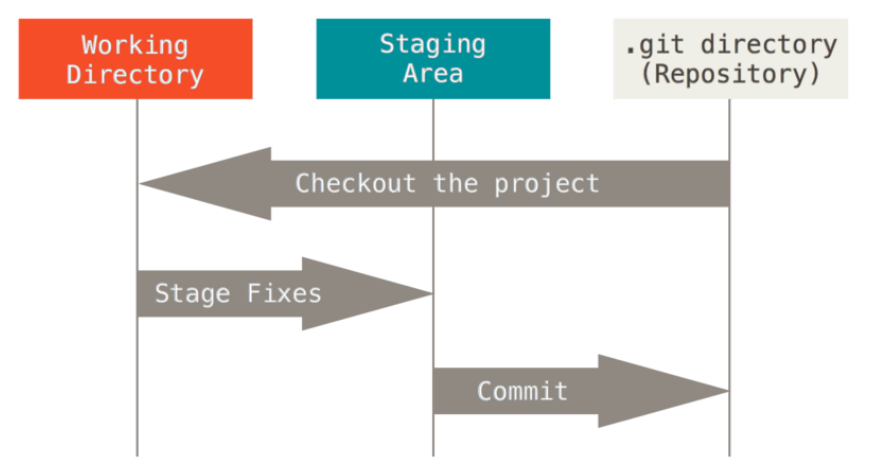

## Git 기초

### 스냅샷

- git은 데이터를 스냅샷으로 취급한다.
- 여기서 스냅샷으로 취급한다는게 뭘까요?
  - 아직 git에 대해 깊게 공부하지 못해서 정확한 설명은 힘들지만 스냅샷은 커밋을 할 때마다 .git/objects에 생성되는걸 스냅샷이라고 합니다.
  - 파일의 내용을 변경하면 git은 기존에 있던 스냅샷과 비교해서 어떤 부분이 변경됐는 지를 파악합니다.
  - 조금 더 자세한 내용은 계속 공부하면서 알아가려고 합니다.
- 참고 : [git이 저장하는 방식 - 박준우블로그](https://junwoo45.github.io/2019-09-03-git%EC%9D%B4%EC%A0%80%EC%9E%A5%ED%95%98%EB%8A%94%EB%B0%A9%EC%8B%9D/), [what is a git snap shot - stackoverflow](https://stackoverflow.com/questions/4964099/what-is-a-git-snapshot)

---

### 거의 모든 명령을 로컬에서 실행

- 거의 모든 명령이 로컬 파일과 데이터만 사용하기 때문에 네트워크는 필요 없다. 그래서 git은 다른 이전의 버전 관리 시스템보다 빠른 속도가 장점이다.
  - 여기서 **거의**라는 표현을 쓴 이유는 뭘까요?
  - `git add`, `git commit`과 같이 작업을 하는데 필요한 대부분의 git 명령은 .git 디렉토리에 있는 파일만으로도 사용이 가능합니다.
  - 하지만 `git pull`, `git push`, `git remote`와 같이 리모트 저장소(github을 통해 들어가면 볼 수 있는 저장소들)와 관련된 명령은 네트워크가 필요합니다.
  - 참고 : [Offline use of Git - stackoverflow](!https://stackoverflow.com/questions/41745601/offline-use-of-git)
- 예를 들면 Git은 프로젝트의 히스토리를 조회할 때 서버없이 조회한다. 그래서 어떤 파일의 현재 버전과 한 달 전의 상태를 비교하고 싶을 때도 리모트에 접근해서 조회하지 않아도 된다.
- 또한 인터넷이 연결되지 않은 상태에서 작업 후 커밋이 가능하다.

---

### Git의 무결성(Integrity)

- git은 데이터를 저장하기 전에 항상 체크섬을 구하고 그 체크섬으로 데이터를 관리한다.
- 체크섬은 Git에서 사용하는 가장 기본적인 데이터 단위이자 Git의 기본 철학이다.
- Git은 SHA-1 해시를 이용해서 체크섬을 만드는데 Git 없이는 체크섬을 다룰 수가 없어서 Git이 꼭 필요하다.
- SHA-1을 통해 만든 체크섬은 40자 길이의 16진수 문자열이다. 파일의 내용이다 디렉토리 주로를 이용해서 체크섬을 구한다.
- 하나의 예를 들면 `24b9da6552252987aa493b52f8696cd6d3b00373`와 같은 문자열이다.
  - 아직 **체크섬**이 어떻게 데이터를 관리하는지는 모르지만 `git log` 명령을 사용하면 볼 수 있다.
    

---

### Git은 데이터를 추가할 뿐

- git은 데이터베이스에 추가만 할 뿐 삭제하지는 않는다. 이 뜻은 파일의 내용은 변경할 수 있지만 그 내용조차 .git 디렉토리에는 추가로 기록이 남는다.
- git의 데이터와 우리가 관리하는 파일 및 폴더는 다른 데이터이다.

### 세 가지 상태

- git은 파일을 **Committed**, **Modified**, **Staged** 이렇게 세 가지 상태로 관리한다.
  - **Committed** : 데이터가 로컬 데이터베이스에 안전하게 저장된 상태
  - **Modified** : 수정한 파일을 아직 로컬 데이터베이스에 커밋하지 않은 상태
  - **Staged** : 수정한 파일을 곧 커밋할 것이라고 표시한 상태
- 이 3가지 상태는 Git 프로젝트의 3가지 단계와 연결돼 있다. > **Git Directory**, **Working Tree**, **Staging Area**.
  
  - **Git Directory** : git이 프로젝트의 메타데이터와 객체 데이터베이스를 저장하는 곳. clone을 할 때 Git Directory가 만들어진다.
  - **Working Tree** : 프로젝트의 특정 버전을 Checkout 한 것이다. 내가 작업하고 있는 로컬에 git directory가 있고, 그 디렉토리에 있는 데이터로 working tree를 만든다.
  - **Staging Area** : git directory에 있으며 곧 커밋할 파일에 대한 정보를 저장한다.
- 위에서 배운 내용을 토대로 우리가 git을 통해 프로젝트를 관리 한다면,
  1. `Working Tree`에서 파일을 수정하면 그 파일을 `Modified` 상태의 파일이다.
  2. 수정한 파일을 `Staging Area`에 `Stage`해서 커밋할 스냅샷을 만들면 파일은 `Staged` 상태이다. 단, `Staging Area`에 추가한 파일이 아니면 아직 `Modified` 상태이다.
  3. 그리고 `Staged` 상태의 파일을 `commit`해서 `Git Directory`로 간다면 파일은 `Committed` 상태가 된다. 이 또한 `commit`하지 않은 파일은 아직 `Staging Area`에 있다.

---

### CLI

- Git은 CLI와 GUI를 사용해서 이용이 가능하다
  - 하지만 CLI가/를 ~~더 멋있는거 같아서..~~ 위주로 공부해보려 합니다.
- terminal과 powershell 중심의 공부

---

### Git 설치 및 기본 설정

- git 자체에 대한 공부다 보니 설치 및 기본 설정은 생략합니다.

---

- 아직 완벽히 이해하지는 못했고 찾는 과정에서 나왔던 블로그([github blog](!https://github.blog/2020-12-17-commits-are-snapshots-not-diffs/))에 대해 더 깊게 공부하고 싶긴 하지만 먼저 progit을 끝까지 마무리한 후에 추가로 공부하려고 합니다.
- 사진출처: [progit](!https://git-scm.com/book/en/v2/Getting-Started-What-is-Git%3F)
