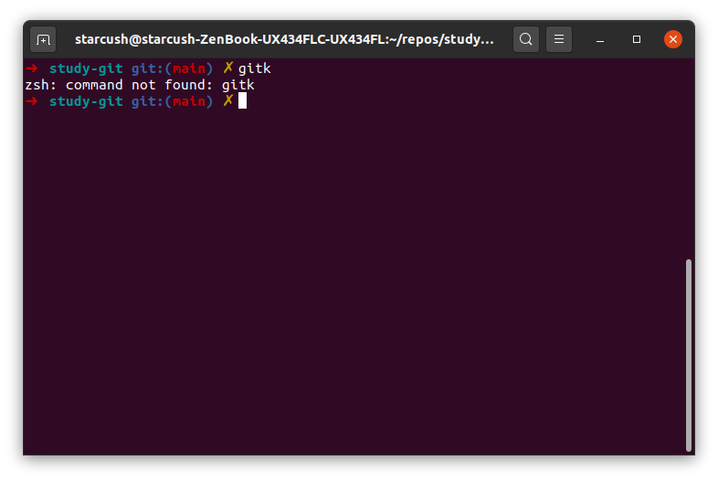
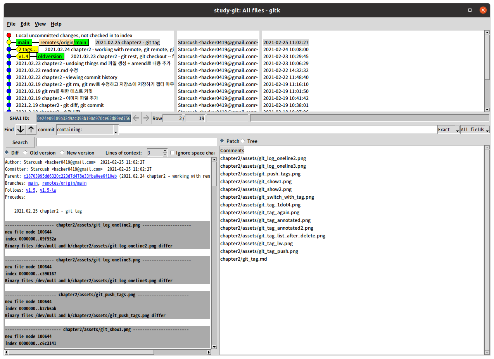
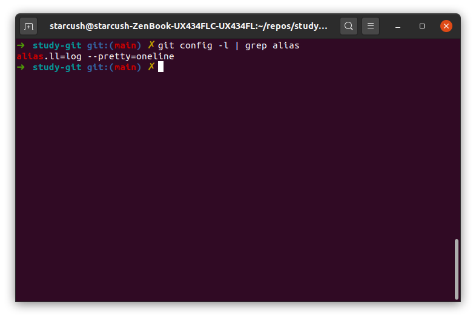

## Git Alias

`git` 명령은 정확하게 입력하지 않으면 안되는데 종종 꽤 긴 명령이 존재한다. 예를 들면 `git log --pretty=oneline`같은?

그래서 이럴 때는 `git config`를 이용하여 `Alias`를 만든다면 보다 쉽게 명령을 사용할 수 있을 것이다. `progit`에서 제시한 예시를 보자

```
$ git config --global alias.co checkout
$ git config --global alias.br branch
$ git config --global alias.ci commit
$ git config --global alias.st status
```

이렇게 설정한다면 `git ci`만으로 `git commit` 명령을 실행할 할 수 있다. 위에서 본것 처럼 한 단어만 설정할 수 있는건 아닌데 예를 들면 다음과 같은게 있다.

```
$ git config --global alias.unstage 'reset HEAD --'
```

이렇게 설정한다면 아래 두 명령은 동일한 명령이다.

```
$ git unstage fileA
$ git reset HEAD -- fileA
```

하나의 예로 가장 최근 커밋을 확인할 수 있는 `alias`를 만들어보자

```
$ git config --global alias.last 'git log -1 HEAD'
```

그리고 `Git`의 명령어 뿐만 아니라 외부 명령어도 실행할 수 있다. `!`를 제일 앞에 추가하면 사용이 가능하다.

```
$ git config --global alias.visual '!gitk'
```

- `gitk`가 뭘까?? 터미널에 입력했더니 찾을 수 없는 명령이라고 한다. `git` 페이지([링크](https://git-scm.com/book/ko/v2/Appendix-A%3A-%EB%8B%A4%EC%96%91%ED%95%9C-%ED%99%98%EA%B2%BD%EC%97%90%EC%84%9C-Git-%EC%82%AC%EC%9A%A9%ED%95%98%EA%B8%B0-GUI))에는 git을 설치하면 같이 설치된다고 하는데 문제를 찾아보고 `gitk`가 뭘 보여주는지 알아보자.

  

- 그냥 `sudo apt-get install gitk` 를 통해 설치했더니 등장했다.

  

### 마무리

- 그럼 이미 설정한 `alias`는 어떻게 확인할까요??

  - `git config --list`를 사용하면 내가 설정한 config를 모두 확인이 가능합니다.
  - 그리고 `grep alias`를 같이 사용해준다면 `config` 중에서 `alias`라는 문자열이 있는걸 검색해 줍니다.

  ```
  $ git config --list | grep alias
  $ git config -l | grep alias
  ```

  

- `alias`라는 기능이 있는건 얼마 전에 알았는데, 이번 공부를 통해 알게되는 많은 명령어를 `alias`를 통해서 편하게 사용하고 싶다는 생각
