## 태그

`tag`는 보통 릴리즈할 때 사용하는데 어떻게 확인하고 어떻게 생성하는지 알아보자.

### 태그 조회하기

아직 까지 태그를 붙인적이 없기 때문에 `progit`에 있는 예제를 통해 알아보자.

`git tag` 명령을 이용하면 이미 만들어진 태그가 있는지 확인할 수 있다.

```
$ git tag
v0.1
v1.3
```

검색 패턴을 사용해서 원하는 태그를 검색할 수 있는데 예를들면 버전 1.8.5 태그들만 검색하고 싶다면 다음과 같이 검색할 수 있다.

```
$ git tag -l "v1.8.5*"
v1.8.5
v1.8.5-rc0
v1.8.5-rc1
v1.8.5-rc2
v1.8.5-rc3
v1.8.5.1
v1.8.5.2
v1.8.5.3
v1.8.5.4
v1.8.5.5
```

### 태그 붙이기

태그의 종류는 `Ligthweight`태그와 `Annotated` 태그로 두 종류가 있다.

- **`Lightweight`**: 이 태그는 이미 있는 커밋 체크섬에 붙인다. 그렇기 때문에 해당 커밋 이외에 어떤 다른 정보도 가지고 있지 않는다.
- **`Annotated`**: 이 태그는 태그를 만든 사람의 이름, 만든 날짜, 태그 메세지 등 다양한 정보를 저장할 수 있다.

그럼 지금 실제로 `lightweight`, `annotated` 태그를 만들어보고 내용을 확인해보자.

### `Annotated` 태그

`git tag -a` 명령을 이용하면 `annotated` 태그를 만들 수 있다. `chapter2 - git tag` 의 메세지를 담은 1.6버전의 태그를 만들어보자.

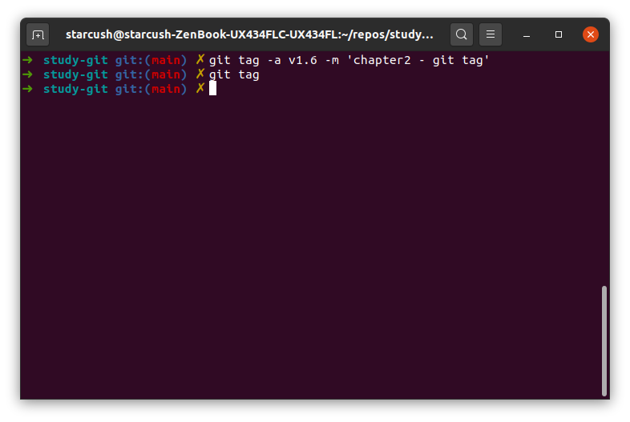
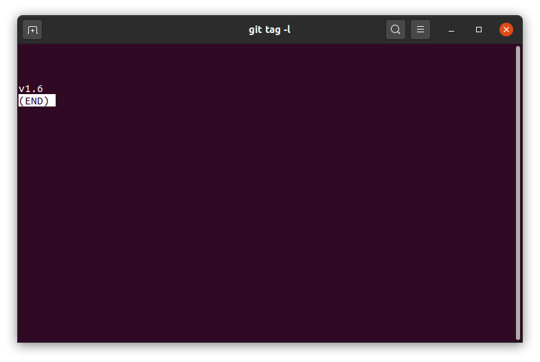

그런데 만들고 보니 현재 커밋된 내용은 `working with remote`까지의 내용이기 때문에 `tag`의 내용을 변경하고 싶다. 이럴 땐 기존의 태그를 삭제하자.

```
$ git tag -d v1.6
```

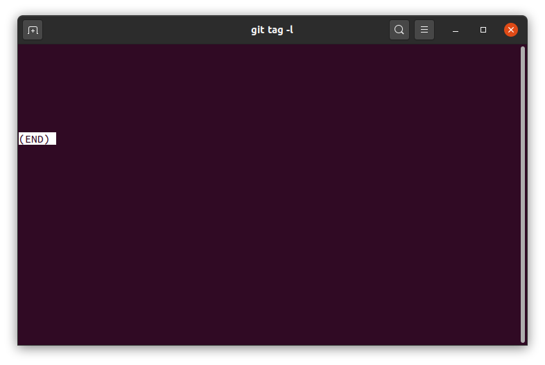

`git tag -l`를 통해 확인해도 아까 생성한 태그가 없는 것을 볼 수 있다. 그러면 다시 v1.5의 태그를 생성해보자.

```
$ git tag -a v1.5 -m 'chapter2 - working with remote'
```

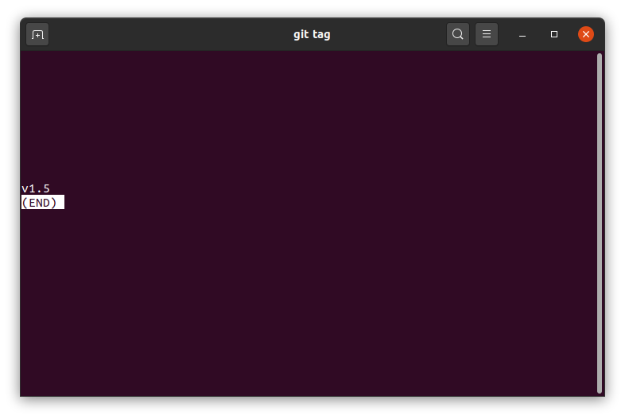

`v1.5` 태그 생긴 것을 확인 할 수 있다.

`git tag` 혹은 `git tag -l`을 통해서는 어떤 태그가 있는지 확인이 가능한데 입력했던 자세한 정보를 얻으려면 어떻게 할까? `git show [버전]`을 입력하면 가능하다.

```
$ git show v1.5
```

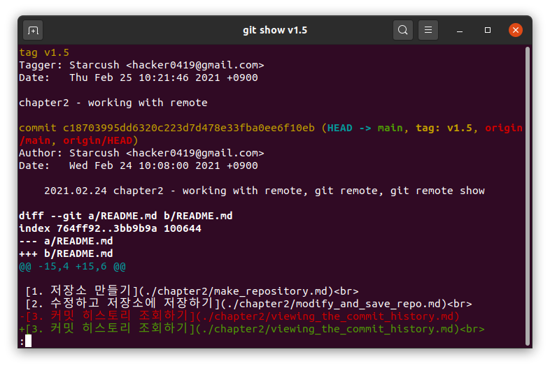

이를 사용하면 커밋의 내용과 태그를 지정할 때의 메세지, 날짜 등의 정보를 확인할 수 있다.

### `Lightweight` 태그

커밋 체크섬에 저장할 뿐이라 다른 정보는 저장하지 않는다. `-s`, `-m`, `-a` 옵션을 사용하지 않는다.

- 여기서 `-m`는 메시지, `-a`는 특정 버전을 새로 생성할 때, 그럼 `-s`는 뭘까?
- [git scm](https://git-scm.com/docs/git-tag)를 확인해보니 `GPG-signed tag`를 만들기 위해 사용한다고 한다.
- 그러면 `GPG-signed tag`는 뭘까?
- 자세한 내용은 보지 않았지만 특정 사람한테서만 커밋을 받기 위해서 사용한다고 한다. [git scm - 내 작업에 서명하기](https://git-scm.com/book/ko/v2/Git-%EB%8F%84%EA%B5%AC-%EB%82%B4-%EC%9E%91%EC%97%85%EC%97%90-%EC%84%9C%EB%AA%85%ED%95%98%EA%B8%B0)

```
$ git tag v1.5-lw
```

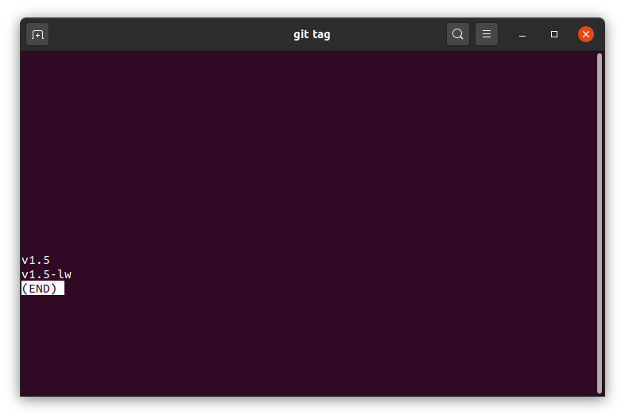

정보를 저장하지 않기 때문에 확인할 수 있는 정보가 따로 없고 해당 커밋 정보만을 보여준다.

```
$ git show v1.5-lw
```

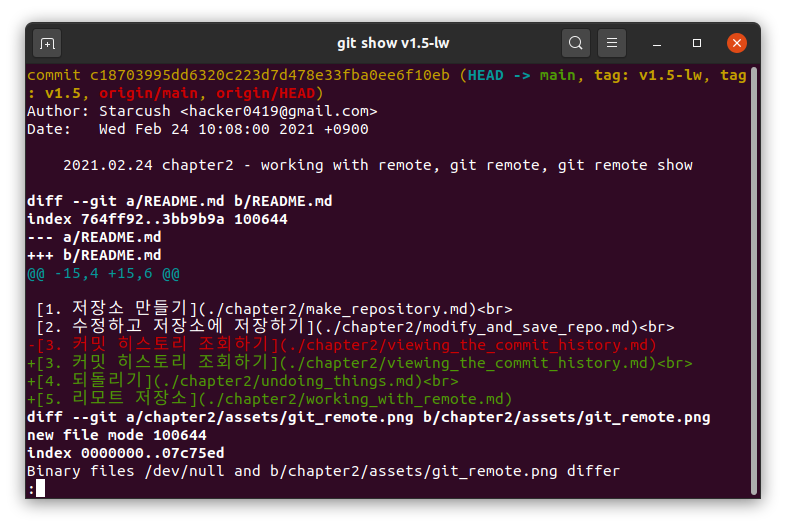

### 나중에 태그하기

최근에 한 커밋이 아니어도 태그할 수 있다.
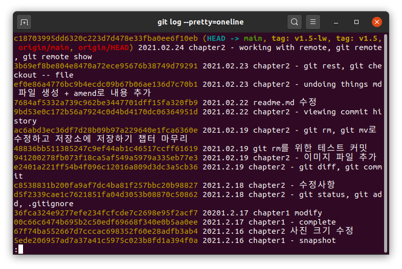
2021.02.23의 마지막에 한 커밋에 v1.4 태그를 달아보자. 태그를 달기 위해서는 커밋 체크섬의 첫 6자리만 알면 가능하다.

```
git tag -a v1.4 3b69ef -m 'chapter2 - undoing things'
```

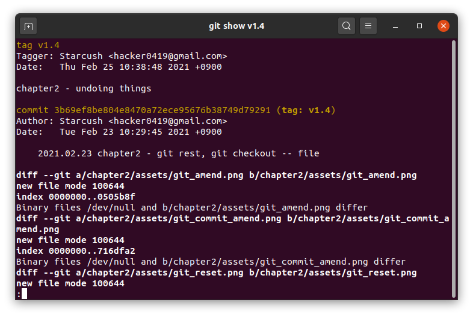
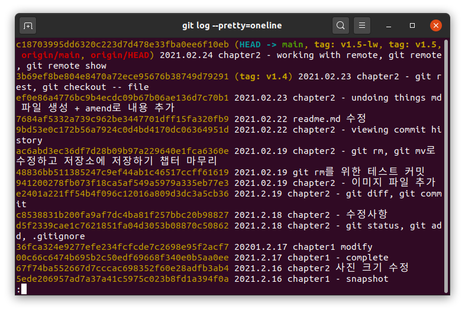

과거에 한 커밋에 1.4 태그가 추가된 것을 확인할 수 있다.

### 태그 공유하기

`git push`를 통해 커밋한 내용을 리모트에 전송한다고 해도 태그가 같이 전송되지 않는다. 태그를 만들었으면 별도로 `push`해야 한다.

```
$ git push origin v1.5
```

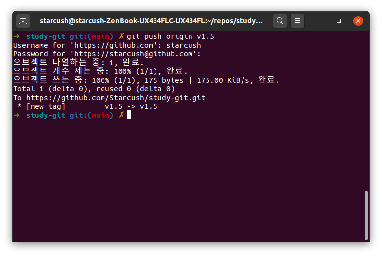

한번에 여러 태그를 `push`하고 싶다면 `--tag` 옵션을 추가하면 된다.

```
$ git push origin --tags
```

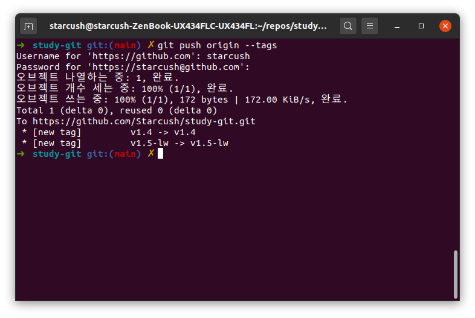

기존에 만들었다. `v1.4`와 `v1.5-lw`가 동시에 전달되는 것을 볼 수 있다.

### 태그를 checkout 하기

태그는 브랜치와는 달리 가리키는 커밋을 바꿀 수 없기 때문에 `checkout`해서 사용할 수 없다. 하지만 태그가 가리키는 특정 커밋 기반의 브랜치를 만들어 작업할 순 있다.

```
$ git switch -c oldversion v1.4
```

- `git 2.23`버전 이후부터는 브랜치와 관련해서는 `checkout`대신 `switch`를 사용한다고 해서 `progit`에 나와있는 대로가 아니라 `switch`를 사용해봤습니다.

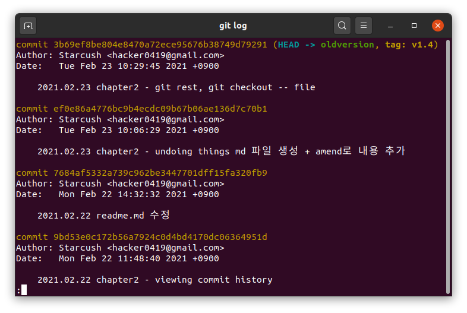

- `v1.4`이후의 내용(24일에 한 내용)이 없는 상태임을 알 수 있습니다.

하지만 `oldversion` 브랜치에 새로운 커밋을 하면 브랜치는 업데이트 되미잠 `v1.4`태그가 가리키는 커밋은 변하지 않으므로 두 내용이 가리키는 커밋이 다르다는 것을 알 수 있다.

### 마무리

- `tag`를 만드는건 알겠는데 `lightweight`와 `annotated` 중 무엇을 사용하면 좋을까?
- 이는 `progit`에도 설명이 나왔었지만 추가로 내용을 찾아본 결과([stackoverflow](https://stackoverflow.com/questions/4971746/why-should-i-care-about-lightweight-vs-annotated-tags/4971817#4971817)) `tag`를 태그를 만든 날짜나 만든 사람 및 내용을 언제든 확인 할 수 있도록 `annotated` 태그를 사용하는게 좋다고 이야기한다.
