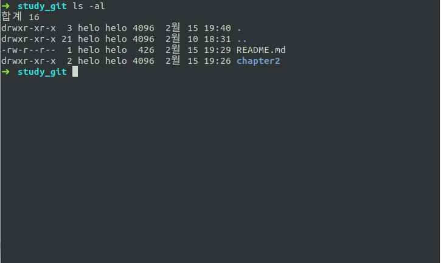
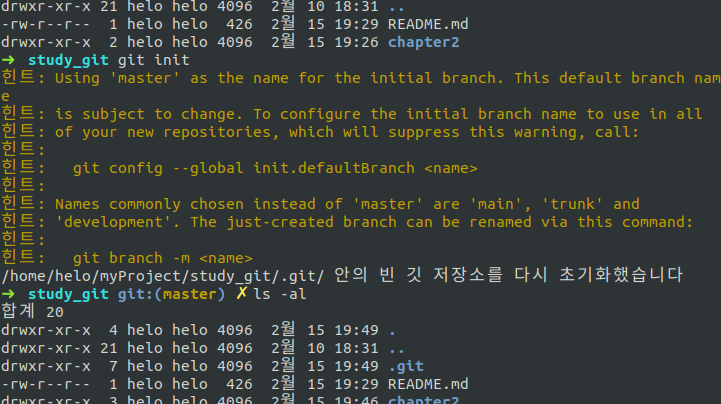
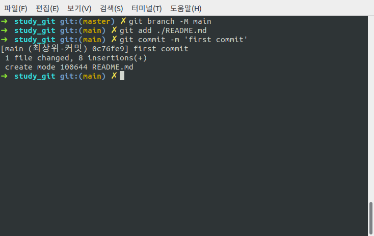
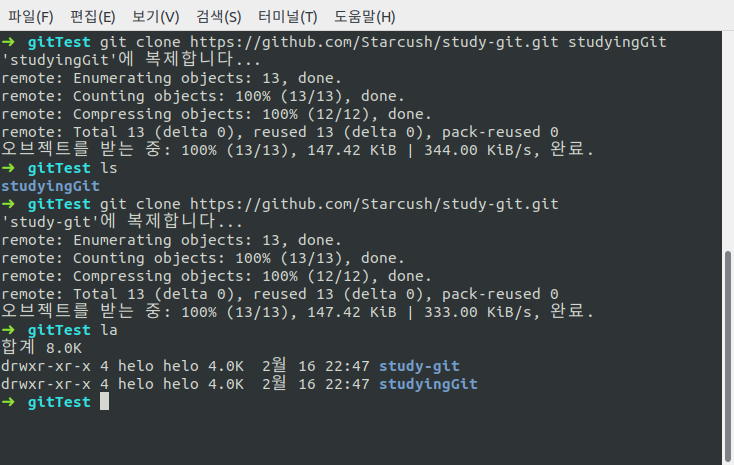

## git 저장소 만들기

### git 저장소를 만드는 2가지 방법

1. 기존 프로젝트나 디렉토리를 git 저장소로 만드는 방법
2. 다른 서버에 있는 저장소를 clone

#### 1. 기존 프로젝트나 디렉토리를 git 저장소로

1. 저장소로 이동한다.(linux)<br>

   ```
   $ cd myProject/study_git
   ```

2. `git init` 명령어를 통해서 `.git`이라는 하위 디렉토리를 만든다.<br><br>
   &nbsp;
   
   <br>
   `.git`디렉토리에는 저장소(repository)에 필요한 뼈대가 있지만 자세한 내용은 이후에 다시 알아보자.

3. 이후에는 `git add`명령을 통해 파일을 추가하고 `git commit`명령으로 커밋한다. <br>
   추가내용으로 github에서 기본 브랜치를 `master`에서 `main`으로 변경하기로 했고([github page](https://github.com/github/renaming)) master 브랜치의 이름을 main으로 변경한 후 진행해 봤다<br>
   

   ```
   git branch -M main
   git add [file_name]
   git commit -m 'commit message'
   ```

#### 2. clone

1. `git clone`명령을 이용해서 clone을 생성한다.
   ```
   git clone https://github.com/Starcush/study-git.git
   ```
   `git clone`을 사용하면 프로젝트의 히스토리를 전부 받아온다.
2. 디텍토리 이름은 따로 설정하고 싶다면 `url`뒤에 원하는 디렉토리 이름을 작성한다<br>
   `git clone url directory_name`

   ```
   git clone https://github.com/Starcush/study-git.git studyingGit
   ```

   <br>


