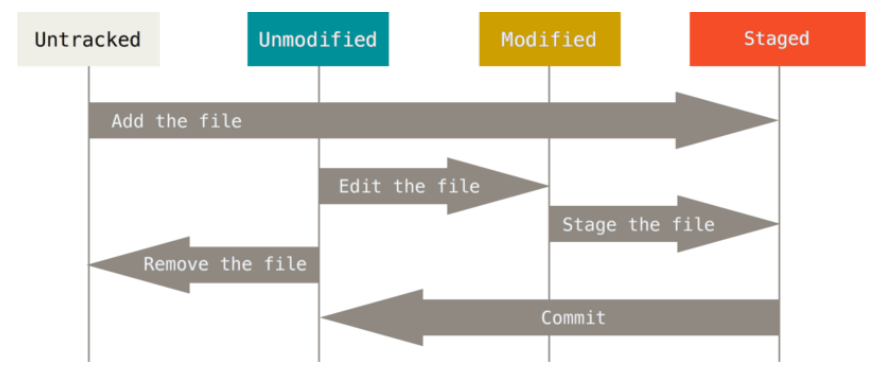
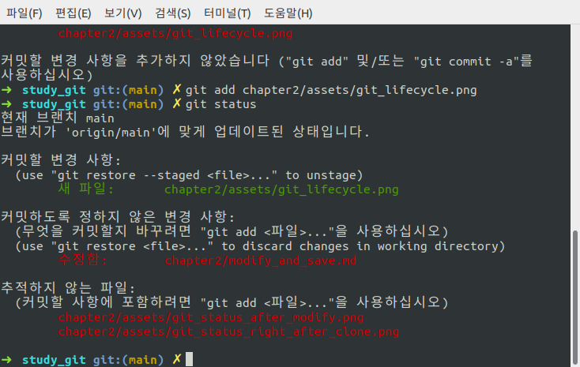
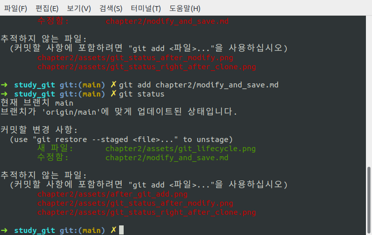
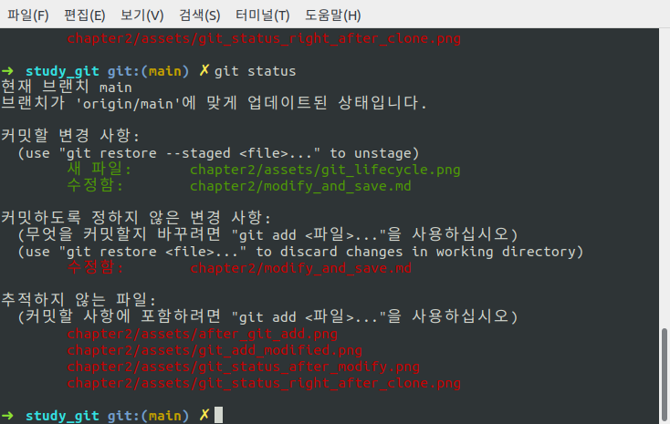

## 수정하고 저장소에 저장하기

git clone명령을 통해 서버에 있는 데이터를 가져오면서 git 저장소를 만들었고 워킹 디렉토리에 Checkout도 했다. 이번에는 파일을 수정하고 파일의 스냅샷을 커밋해 보자.

- **Tracked & Untracked** : Working Directory의 모든 파일은 기존 스냅샷에 포함돼있는(한 번이라도 커밋한 기록이 있는) **Tracked**와 아직 포함되있지 않는(한 번도 커밋한 적이 없는) **Untracked**로 나눈다.
- **Tracked > Unmodified & Modified & Staged** : **Tracked** 파일(스냅샷에 포함된 적 있는 파일)은 아직 수정하지 않은 **Unmodified**, 수정한 **Modified**, 커밋하기 위해 **Staging Area**에 올려둔 **Staged**상태로 나눌 수 있다.
- 나머지는 전부 **Untracked**파일이다.
- 그래서 처음에 저장소를 `clone`하고 나면 모든파일은 **Tracked**이면서 **Unmodified**상태이다.
- 마지막 커밋 이후 파일을 수정하면 **Modified** 상태, 이후 **Staged**상태로 만들고 커밋한다.(**Modified**상태는 커밋할 수 없다.)

  

### 파일의 상태 확인하기

- `git status`명령을 사용하면 파일의 상태(Staged, ..)확인이 가능하다.
  `git clone`을 한 직후에는 워킹 디렉토리에 있는 모든 파일이 **Tracked**이며 수정하기 전이기 때문에 아래와 같은 메세지를 볼 수 있다.
  
- 이후 Untracked file을 추가하고 Tracked file을 수정하면 아래와 같은 메세지를 볼 수 있다.
  (단, 아래의 이미지는 clone 직후의 상태는 아니고 어제 커밋을 하고 난 후 수정한 상태이다.)
  

### 파일을 새로 추적하기(Tracking)

- `git add`명령으로 파일을 새로 추적할 수 있다. 새로 추가한 png 파일을 추적해보자.

  ```
  git add chapter2/assets/git_lifecycle.png
  ```

    

- 이 문서를 작업하다보니 새로운 이미지를 추가했고 `git_status_after_modify.png`외 1개의 파일이 추가로 존재한다.
- **커밋할 변경 사항**에 있는 파일은 **Staged** 상태라는 것을 의미한다. `git commit`명령을 실행했을 때 저장소의 히스토리에 기록될 파일이다.

### Modified 상태의 파일을 Stage 하기

- 위의 이미지에서 **커밋하도록 정하지 않은 변경 사항**에 있는 파일이 **Modified** 상태(Tracked 파일)의 파일인데 여기에 있는 파일을 Stage Area로 옮겨보자.

  ```
  git add chapter2/modify_and_save.md
  ```

    

- 그런데 Stage 시킨 후 해당 파일을 다시 수정하면 커밋할 변경 사항(**Staged 상태**)이면서 동시에 커밋하도록 정하지 않은 변경 사항(**Unstaged 상태**)로 나온다.

    

  - 이는 `git commit`명령을 실행하는 시점에 맞는 버전이 커밋되는게 아니라 마지막으로 `git add`를 실행한 시점의 버전이 커밋된다. 그렇기 때문에 `git add`명령을 실행한 후 파일을 수정했다면 다시 `git add`명령을 사용해서 최신 버전을 Staged 상태로 만들어야 한다.

  

  - 커밋하도록 정하지 않은 변경 사항(**Unstaged 상태**)에 `chapter2/modify_and_save.md `파일이 없어진 것을 볼 수 있다.

### 파일 상태를 짤막하게 확인하기

- `git status -s` 또는 `git status --short`와 같은 옵션을 주면 파일 상태를 짤막하게 확인할 수 있다.

  

  - `git stattus -s`을 사용하면 2가지 정보가 확인이 가능한데 왼쪽에는 **Staging Area**의 상태를 오른쪽에는 **Working Tree**에서의 상태를 표시한다.
  - **??** : Untracked 파일
  - **A** : Untracked 파일인데 Staged 상태(파일을 추가했다) - **Staging Area**
  - **M** : Tracked 파일인데 Modified 상태(파일을 수정했다) - **Staging Area**
  - **MM** : Tracked 파일인데 Stage 한 후 또 수정했다. - **Staging Area & Working Area**

### 파일 무시하기

- Git을 통해 관리할 필요가 없는 파일도 존재한다. 그런 파일은 `.gitignore`파일을 만들고 무시할 패턴을 적어준다.
- `.gitignore`파일에 입력하는 패턴
  - 아무것도 없는 라인이나, '#'로 시작하는 라인은 무시한다.
  - 표준 Glob 패턴을 사용한다.
    - 표준 Glob 패턴이 뭘까요?
    - 정규표현식과 비슷한데 조금 다른 방식
    - 그 내용을 확인할 수 있는 블로그가 있길래 가져와 봤다.([Glob 패턴과 정규표현식](https://velog.io/@k7120792/Glob-%ED%8C%A8%ED%84%B4%EA%B3%BC-%EC%A0%95%EA%B7%9C%ED%91%9C%ED%98%84%EC%8B%9D))
  - 슬래시(`/`)로 시작하면 하위 디렉토리에 적용되지(Recursivity) 않는다.
  - 디렉토리는 슬래시(`/`)를 끝에 사용하는 것으로 표현한다.
  - 느낌표(`!`)로 시작하는 패턴의 파일은 무시하지 않는다.
- `.gitignore`파일의 예

  ```
  # 확장자가 .js인 파일 무시
  *.js

  # 윗 라인에서 확장자가 .js인 파일은 무시하게 했지만 main.js는 무시하지 않음
  !main.js

  # 현재 디렉토리에 있는 TODO파일은 무시하고 subdir/TODO처럼 하위디렉토리에 있는 파일은
  무시하지 않음
  /TODO

  # node_modules/ 디렉토리에 있는 모든 파일은 무시
  node_modules/

  # doc/notes.txt 파일은 무시하고 doc/server/arch.txt 파일은 무시하지 않음
  doc/*.txt

  # doc 디렉토리 아래의 모든 .pdf 파일을 무시
  doc/**/*.pdf
  ```
