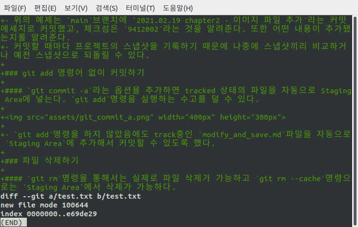

## 수정하고 저장소에 저장하기

git clone명령을 통해 서버에 있는 데이터를 가져오면서 git 저장소를 만들었고 워킹 디렉토리에 Checkout도 했다. 이번에는 파일을 수정하고 파일의 스냅샷을 커밋해 보자.

- **Tracked & Untracked** : Working Directory의 모든 파일은 기존 스냅샷에 포함돼있는(한 번이라도 커밋한 기록이 있는) **Tracked**와 아직 포함되있지 않는(한 번도 커밋한 적이 없는) **Untracked**로 나눈다.
- **Tracked > Unmodified & Modified & Staged** : **Tracked** 파일(스냅샷에 포함된 적 있는 파일)은 아직 수정하지 않은 **Unmodified**, 수정한 **Modified**, 커밋하기 위해 **Staging Area**에 올려둔 **Staged**상태로 나눌 수 있다.
- 나머지는 전부 **Untracked**파일이다.
- 그래서 처음에 저장소를 `clone`하고 나면 모든파일은 **Tracked**이면서 **Unmodified**상태이다.
- 마지막 커밋 이후 파일을 수정하면 **Modified** 상태, 이후 **Staged**상태로 만들고 커밋한다.(**Modified**상태는 커밋할 수 없다.)

  

### 파일의 상태 확인하기

- `git status`명령을 사용하면 파일의 상태(Staged, ..)확인이 가능하다.
  `git clone`을 한 직후에는 워킹 디렉토리에 있는 모든 파일이 **Tracked**이며 수정하기 전이기 때문에 아래와 같은 메세지를 볼 수 있다.
  
- 이후 Untracked file을 추가하고 Tracked file을 수정하면 아래와 같은 메세지를 볼 수 있다.
  (단, 아래의 이미지는 clone 직후의 상태는 아니고 어제 커밋을 하고 난 후 수정한 상태이다.)
  

### 파일을 새로 추적하기(Tracking)

- `git add`명령으로 파일을 새로 추적할 수 있다. 새로 추가한 png 파일을 추적해보자.

  ```
  git add chapter2/assets/git_lifecycle.png
  ```

    

- 이 문서를 작업하다보니 새로운 이미지를 추가했고 `git_status_after_modify.png`외 1개의 파일이 추가로 존재한다.
- **커밋할 변경 사항**에 있는 파일은 **Staged** 상태라는 것을 의미한다. `git commit`명령을 실행했을 때 저장소의 히스토리에 기록될 파일이다.

### Modified 상태의 파일을 Stage 하기

- 위의 이미지에서 **커밋하도록 정하지 않은 변경 사항**에 있는 파일이 **Modified** 상태(Tracked 파일)의 파일인데 여기에 있는 파일을 Stage Area로 옮겨보자.

  ```
  git add chapter2/modify_and_save.md
  ```

    

- 그런데 Stage 시킨 후 해당 파일을 다시 수정하면 커밋할 변경 사항(**Staged 상태**)이면서 동시에 커밋하도록 정하지 않은 변경 사항(**Unstaged 상태**)로 나온다.

    

  - 이는 `git commit`명령을 실행하면 `git commit`을 실행한 시점이 아니라 마지막으로 `git add`를 실행한 시점의 파일이 커밋된다. 그렇기 때문에 `git add`명령을 실행한 후 파일을 수정했다면 다시 `git add`명령을 사용해서 최신 버전을 **Staged** 상태로 만들어야 한다.

  

  - `git add`명령으로 최신 버전의 파일을 추가했더니 커밋하도록 정하지 않은 변경 사항(**Unstaged 상태**)에 `chapter2/modify_and_save.md `파일이 없어진 것을 볼 수 있다.

### 파일 상태를 짤막하게 확인하기

- `git status -s` 또는 `git status --short`와 같은 옵션을 주면 파일 상태를 짤막하게 확인할 수 있다.

  

  - `git stattus -s`을 사용하면 2가지 정보가 확인이 가능하다
  - 왼쪽: **Staging Area**의 상태 / 오른쪽: **Working Tree**의 상태
  - **??** : Untracked 파일
  - **A** : Untracked 파일인데 Staged 상태(파일을 추가했다) - **Staging Area**
  - **M** : Tracked 파일인데 Modified 상태(파일을 수정했다) - **Staging Area**
  - **MM** : Tracked 파일인데 Stage 한 후 또 수정했다. - **Staging Area & Working Area**

### 파일 무시하기

#### `.gitignore` 파일을 통해 tracking 하지 않기를 원하는 파일 및 폴더를 설정 할 수 있다.

- Git을 통해 관리할 필요가 없는 파일도 존재한다. 그런 파일은 `.gitignore`파일을 만들고 무시할 패턴을 적어준다.
- `.gitignore`파일에 입력하는 패턴
  - 아무것도 없는 라인이나, '#'로 시작하는 라인은 무시한다.
  - 표준 Glob 패턴을 사용한다.
    - 표준 Glob 패턴이 뭘까요?
    - 정규표현식과 비슷한데 조금 다른 방식
    - 그 내용을 확인할 수 있는 블로그가 있길래 가져와 봤다.([Glob 패턴과 정규표현식](https://velog.io/@k7120792/Glob-%ED%8C%A8%ED%84%B4%EA%B3%BC-%EC%A0%95%EA%B7%9C%ED%91%9C%ED%98%84%EC%8B%9D))
  - 슬래시(`/`)로 시작하면 하위 디렉토리에 적용되지(Recursivity) 않는다.
  - 디렉토리는 슬래시(`/`)를 끝에 사용하는 것으로 표현한다.
  - 느낌표(`!`)로 시작하는 패턴의 파일은 무시하지 않는다.
- `.gitignore`파일의 예

  ```
  # 확장자가 .js인 파일 무시
  *.js

  # 윗 라인에서 확장자가 .js인 파일은 무시하게 했지만 main.js는 무시하지 않음
  !main.js

  # 현재 디렉토리에 있는 TODO파일은 무시하고 subdir/TODO처럼 하위디렉토리에 있는 파일은
  무시하지 않음
  /TODO

  # node_modules/ 디렉토리에 있는 모든 파일은 무시
  node_modules/

  # doc/notes.txt 파일은 무시하고 doc/server/arch.txt 파일은 무시하지 않음
  doc/*.txt

  # doc 디렉토리 아래의 모든 .pdf 파일을 무시
  doc/**/*.pdf
  ```

### Staged와 Unstaged 상태의 변경 내용을 보기

#### 변경된 파일이 아닌 내용을 확인하고 싶을 땐 `git status`가 아닌 `git diff`, `git diff --staged`, `git diff --cache`

- 보통 어떤 파일이 `staged`상태이고 어떤 파일이 `staged`상태가 아닌지 확인하기 때문에 `git status`명령으로도 충분하기도 하지만
- `unstaged`상태의 파일에서 어떤 라인이 추가되고 삭제됐는지 구체적으로 확인하고 싶다면 `git diff`명령을 사용하면 된다.
- 어제 마지막 커밋을 한 후 작성한 내용은 위의 3줄인데 이 상황에서 `git diff`명령을 사용해보자.
  

  - 위의 이미지를 보면 `chapter2/modify_and_save.md`파일에서 어떤 부분이 추가됐는지 초록색 글자로 확인이 가능하다.
  - 그런데 `git diff`명령은 아직 `staged`상태가 아닌 파일만 확인이 가능하다고 하니 지금까지의 수정내용을 `git add`를 통해 `staged`상태로 변경한 후 다시 `git diff`명령을 사용해보자.

  

  - 아무 내용이 없는 것을 확인할 수 있다.
  - 그래서 이럴 때는 `git diff --staged` 혹은 `git diff --cache`라는 옵션을 주면 `staged`상태의 파일을 확인이 가능하다.

  

- 참고로 tool을 사용해서도 비교가 가능한데 `git difftool` 명령을 사용해서 emerge, vimdiff 같은 도구로 비교할 수 있다. 지금 vim을 사용하기 때문에 vimdiff로 설정했는데 tool을 설정하는 방법은 [git difftool 사용법](https://goodtogreate.tistory.com/entry/git-difftool-%EC%82%AC%EC%9A%A9%EB%B2%95) 블로그를 참고했습니다.

### 변경사항 커밋하기

#### `git commit` 명령을 사용해서 커밋한다.

- `git add`를 통해 `Staging Area`에 파일을 옮겨뒀다면 `git commit`을 통해 커밋이 가능하다. `git commit`을 통해서는 `staged`상태의 파일만 커밋이 가능하다는 사실을 기억하자. `modified`상태의 파일은 커밋이 불가능하다.
  

  - `git commit`명령을 입력하면 다음과 같은 창이 뜨는데 이는 `vim` 편집기의 화면이다. 다른 편집기를 사용하고 싶다면 `git config --global core.editor`를 통해 설정이 가능하다.

  

  - 어떤 내용을 수정했는지 커밋 메세지에 작성하고 커밋을 완료한다. 이미지의 경우에는 `chapter2`의 `modify_and_save.md`파일에 `git diff`와 `git commit`에 관한 내용을 추가했으므로 위와 같이 작성했습니다.
  - `git commit`이 아닌 `git commit -m`을 사용하면 `vim` 편집기를 사용하지 않고 커밋이 가능하다.

  

  - `git commit -m`명령을 통해 새로 추가한 스크린샷 이미지를 추가하는 커밋을 작성했다.

- 커밋이 완료된 위의 이미지를 보면 `git commit`명령이 몇 가지의 정보를 출력 하는 것을 알 수 있다.
- 위의 예제는 `main`브랜치에 `2021.02.19 chapter2 - 이미지 파일 추가`라는 커밋 메세지로 커밋했고, 체크섬은 `9412002`라는 것을 알려준다. 또한 어떤 내용이 추가됐는지를 알려준다.
- 커밋할 때마다 프로젝트의 스냅샷을 기록하기 때문에 나중에 스냅샷끼리 비교하거나 예전 스냅샷으로 되돌릴 수 있다.

### git add 명령어 없이 커밋하기

#### `git commit -a`라는 옵션을 추가하면 tracked 상태의 파일을 자동으로 Staging Area에 넣는다. `git add`명령을 실행하는 수고를 덜 수 있다.


- `git add`명령을 하지 않았음에도 track중인 `modify_and_save.md`파일을 자동으로 `Staging Area`에 추가해서 커밋할 수 있도록 했다.

### 파일 삭제하기

#### `git rm`명령을 통해서는 실제로 파일 삭제가 가능하고 `git rm --cache`명령으로는 `Staging Area`에서 삭제가 가능하다.

- `git rm`명령은 `Tracked`상태의 파일에 한해서만 사용이 가능하다. 이를 확인해보기 위해 `test.txt`파일을 추가해 커밋해보았습니다.

  

- 이후 `git rm test.txt`를 실행하고 `git status`로 파일들의 상태를 확인하고 `ls`로 디렉토리에 있는 파일 및 폴더를 확인해보면

  
    
    - 커밋할 파일에 `test.txt`가 포함되어 있고 현재 디렉토리에도 더이상 `test.txt`파일이 없는 것을 확일 할 수 있습니다.
    - 이 내용을 커밋하면 Git은 더이상 `test.txt`파일을 Tracking 하지 않습니다.

- `git rm --cache`명령으로는 `Staging Area`에서만 제거가 가능합니다.

### 파일 이름 변경하기

#### `git mv file_from file_to`명령을 사용하면 file_to로 파일 이름을 변경할 수 있습니다.

- 사실 이 명령은 기존의 파일을 `file_to`의 이름으로 복사한 후 `file_from`을 삭제하는 것과 동일합니다.
