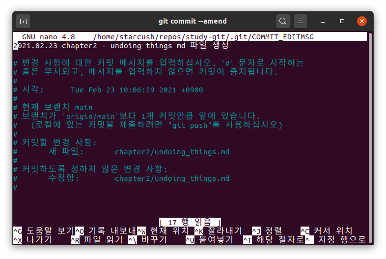
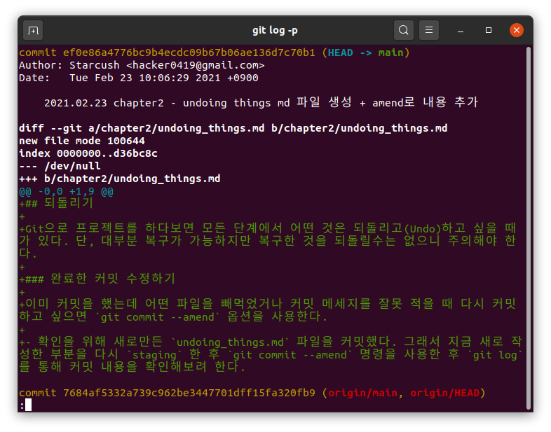
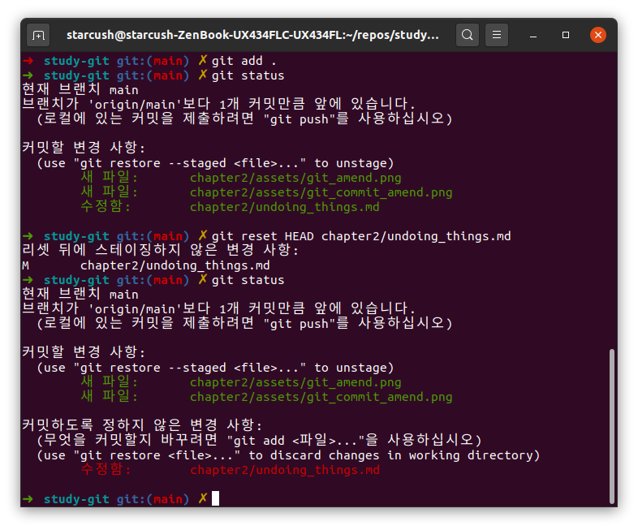

## 되돌리기

Git으로 프로젝트를 하다보면 모든 단계에서 어떤 것은 되돌리고(Undo)하고 싶을 때가 있다. 단, 대부분 복구가 가능하지만 복구한 것을 되돌릴수는 없으니 주의해야 한다.

### 완료한 커밋 수정하기

이미 커밋을 했는데 어떤 파일을 빼먹었거나 커밋 메세지를 잘못 적을 때 다시 커밋하고 싶으면 `git commit --amend` 옵션을 사용한다.

- 확인을 위해 새로만든 `undoing_things.md` 파일을 커밋했다. 그래서 지금 새로 작성한 부분을 다시 `staging` 한 후 `git commit --amend` 명령을 사용한 후 `git log -p` 를 통해 커밋 내용을 확인해보려 한다.
  
  

  - 사진을 통해 확인해보면 `git commit --amend` 명령을 하면 커밋 메세지를 다시 작성할 수 있는 것을 볼 수 있다. 그리고 먼저 했던 커밋의 내용은 `커밋할 변경 사항`에 있고 변경했지만 아직 `stage`상태가 아닌 내용은 `커밋하도록 정하지 않은 변경 사항`에 있다.
  - 그래서 추가로 커밋하고 싶다면 `git add` 명령을 통해 `Staging Area`로 옮긴 뒤에 `git commit --amend` 명령을 사용하면 된다.

### 파일 상태를 Unstage로 변경하기

다음은 `git reset` 명령을 통해 `Staging Area`와 `Working Directory` 사이를 넘나드는 방법(`git add` 한 파일을 되돌리기)을 설명한다.

- 지금까지 추가한 내용을 모두 `git add` 했는데 생각해보니 `undoing_things.md` 파일을 아직 작성할거 같아서 이를 다시 `unstage` 하고 싶다. 그럴 경우에는 `git reset HEAD chapter2/undoing_things.md` 명령을 사용한다.

- `reset`은 더 많은 기능을 가지고 있지만 뒤에서 더 자세히 다룰 것이기 때문에 이번엔 이정도만 알아보자.

### Modified 파일 되돌리기

최근의 커밋 혹은 클론 한 후 파일을 수정 했는데 내용이 마음에 들지 않으면 되돌리는 것이 가능하다.

`git checkout -- [파일명]` 명령을 사용해서 되돌리는게 가능하다. 그런데 지금까지 작성한 내용을 날리고 싶지 않기 때문에 굳이 확인해보지 않으려고 한다.

수정한 내용을 버릴수는 없지만 당장은 되돌려야 하는 경우네는 `stash`, `branch` 명령을 사용하면 되는데 이는 좀 더 뒤에 알아보자.

꼭 알아둬야 할 것은 커밋을 했다면 어떻게서든 복구가 가능하다. 하지만 커밋을 하지 않은 내용을 되돌릴수는 없다.
