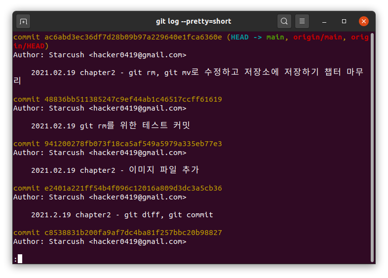

## 커밋 히스토리 조회하기

커밋 히스토리를 조회하고 싶을 때는 `git log`명령을 사용한다.
git을 공부하는 현재 레포지토리의 커밋 히스토리를 확인해보자.

기본 값의 `git log`명령은 히스토리를 최근의 커밋을 가장 처음에 나오고 시간순으로 보여준다. 또한 커밋의 체크섬, 저자 이름과 이메일, 커밋 날짜와 메세지를 함께 보여준다.

### `git log`의 옵션 사용하기

#### `git log -p -2`

커밋 히스토리의 diff 확인하기

- `git log`명령을 사용할 때 `-p`옵션을 사용하면 각 커밋에서 어떤게 달라졌는지(diff)를 보여주고 `-2`옵션은 최근 2개의 결과를 보여준다.
- 그래서 `git log -p -2`명령을 입력하면 다음과 같은 결과가 나오는데 추가한 내용이 많다보니 2개가 나오는 것을 사진으로 보여주기에는 한계가 있었다.
  
  

#### `git log --stat`

커밋의 내용보다는 어떤 파일이 수정됐는지, 몇 개의 파일이 수정됐는지 또 얼마나 많은 라인이 추가되거나 삭제됐는지를 보여준다. 이번에도 `-2` 옵션을 넣어서 최근 2개가 출력되는 것을 확인하고자 했다.

#### `git log --pretty`

커밋 히스토리를 보여주는 형식을 바꿀 수 있다. 예를 들면 `oneline`옵션을 사용하면 각 커밋을 한 라인으로 보여준다.

다른 예로는 `git log --pretty=short`는 간략한 정보만 보여준다.

주목할 만한 옵션은 `--pretty=format`이다. 이는 자신이 원하는 포맷대로 히스토리를 출력할 수 있도록 해준다. 그래서 Git버전이 바뀌어도 항상 동일한 결과를 출력한다.

`progit`에서 보여준 예시를 확인해보자. `git log --pretty=format:"%h - %an, %ar : %s"`를 입력해보면 다음과 같은 결과를 볼 수 있다.

위에서 사용한 `%h`는 커밋의 해시, `%an`는 저자 이름, `%ar`는 저자를 기준으로 하는 상대적 시각, `%s`는 요약인데 이와 관련된 내용은 `progit`에 있는 표를 가져왔다.

- 참고로 커미터는 실제로 커밋한 사람이고 저자는 작업을 수행한 사람으로 서로 다른 사람이 이를 수행했다면 구분할 필요가 있다.

`git log`와 함께 사용하는 주요 옵션들

그런데 이렇게 긴 명령어를 항상 쳐야할까? 축약된 버전은 없을까??

- `git alias`를 사용하면 축약된 명령을 정할 수 있다.
- [pretty git log in one line](https://ma.ttias.be/pretty-git-log-in-one-line/)
- [A better git log](https://coderwall.com/p/euwpig/a-better-git-log)
- [pretty git branch graphs](https://stackoverflow.com/questions/1057564/pretty-git-branch-graphs)

#### `git log`의 조회 범위를 제한하는 옵션

`-n`는 위에서 사용해봤기 때문에 `--since`를 사용한 예시를 작성해보려고 한다.

- `git log since="2021-02-18"` (날짜의 경우 2021.02.18, 2021-02-18 모두 적용할 수 있었다.)
  

- `progit`에 있는 다양한 제한 옵션을 사용하는 예시
  

항상 `git log`만 사용해서 히스토리를 확인했었는데 `graph`를 통해서 브랜치가 생성되고 없어지는 것도 확인이 가능하고 `format`도 정해서 확인할 수 있다는 것을 알 수 있어 유익한 챕터였다. 앞으로는 `alias`를 사용해서 다양한 옵션을 쉽게 사용하는 것이 목표다.
