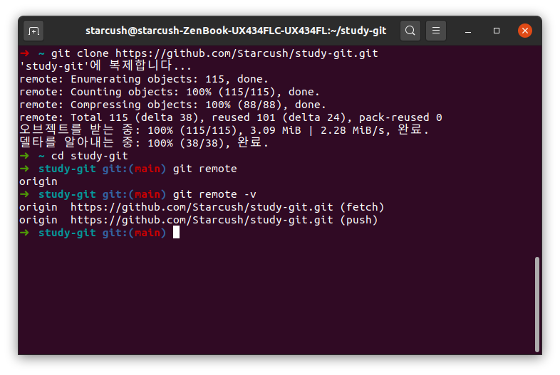
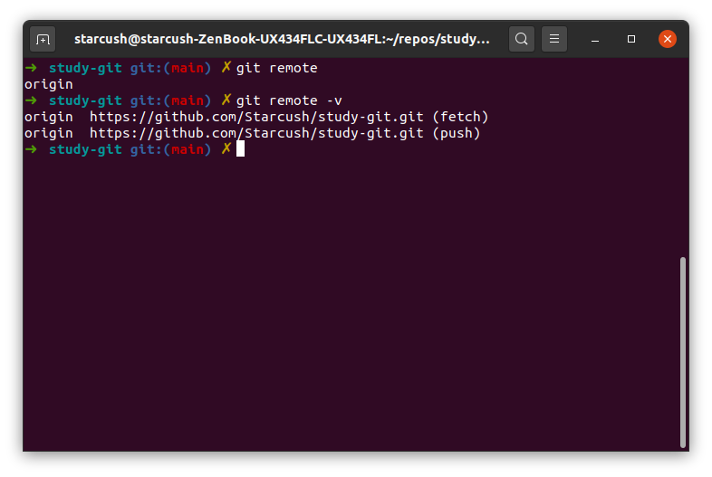
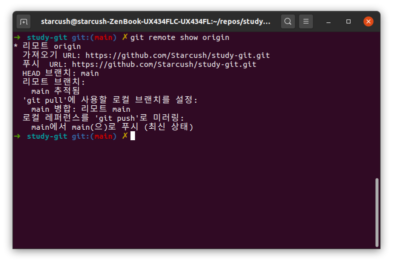
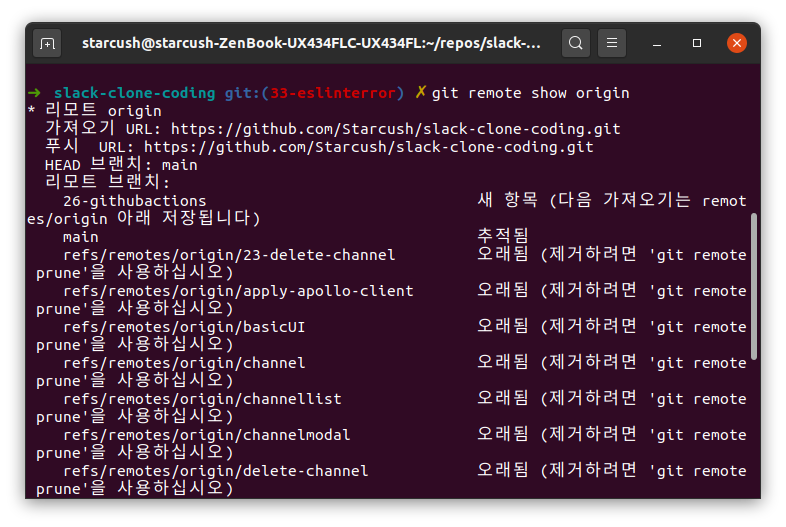

## 리모트 저장소

다른 사람과 같이 일하기 위해서는 인터넷이나 네트워크의 어딘가에 있는 저장소인 리모트 저장소를 관리할 수 있어야 한다. 이는 저장소에 `push`, `pull`을 하고 브랜치를 관리하며 추적할지 말지를 결정하는 일인데 이번에는 저장소를 관리하는 방법에 대해 알아보자.

### 리모트 저장소 확인하기

`git remote` 명령으로 현재 프로젝트에 등록된 리모트 저장소를 확인할 수 있다. 저장소를 `clone`하면 `origin`이라는 리모트 저장소가 자동으로 등록되기 때문에 `origin`이라는 이름을 볼 수 있다.


추가로 지금 `progit`프로젝트의 리모트 저장소를 확인해보자.



### 리모트 저장소 추가하기

이번 내용은 프로젝트를 같이 하고 있지 않기 때문에 실제 스크린샷이 아니 책에 있는 예제 내용으로 알아보자.

`git remote add [단축이름] [url]` 명령을 사용하면 기존 `working directory`에 새 리모트 저장소를 추가할 수 있다.

```
$ git remote
origin
$ git remote add pb https://github.com/paulboone/ticgit
$ git remote -v
origin https://github.com/schacon/ticgit (fetch)
origin https://github.com/schacon/ticgit (push)
pb https://github.com/paulboone/ticgit (fetch)
pb https://github.com/paulboone/ticgit (push)
```

이제 직접적인 `url`대신 단축이름인 `pb`를 사용할 수 있는데 예를 들면 로컬 저장소에는 없지만 `paulboone` 저장소에는 있는 것을 가져오려면 다음과 같이 실행한다.

```
$ git fetch pb
remote: Counting objects: 43, done.
remote: Compressing objects: 100% (36/36), done.
remote: Total 43 (delta 10), reused 31 (delta 5)
Unpacking objects: 100% (43/43), done.
From https://github.com/paulboone/ticgit
* [new branch]  master  ->  pb/master
* [new branch]  ticgit  ->  pb/ticgit
```

`pb/master`는 `paulboone`의 저장소에 있는 `master` 브랜치이고 `bp/ticgit`같은 경우는 `ticgit` 브랜치이다.

### 리모트 저장소를 `Pull`하거나 `Fetch`하기

리모트 저장소에서 데이터를 가져오려면 `git fetch` 명령을 사용한다.

```
git fetch [remote-name]
```

`git fetch` 명령은 로컬에는 없지만 리모트 저장소에 있는 모든 데이터를 가져온다. 때문에 로컬에서 리모트 저장소에 있는 모든 브랜치에 접근할 수 있으며 `Merge`하거나 내용을 확인할 수 있다.

저장소를 `clone`후 `git fetch origin`을 하면 `clone`후 새롭게 작업한 내용들을 다 가져와서 확인이 가능하지만 `merge`는 하지 않는다. `merge`하기 위해서는 수동으로 해줘야 한다.

하지만 데이터를 가져오기도 하고 `merge`도 해주는 명령이 있는데 그게 `git pull`명령이다.

### 리모트 저장소에 `Push`하기

`git push [리모트 저장소 이름] [브랜치 이름]`명령으로 리모트 저장소에 내가 작업한 내용을 전달할 수 있다.
예를 들어 `origin`서버의 `master` 브랜치에 데이터를 전달하고 싶다면 다음과 같이 사용하면 된다.

```
$ git push origin master
```

- 그런데 주의 할 점은 `push` 하려고 하는 서버의 브랜치에 다른사람이 `push`하지 않은 상태에서만 가능하다.
- 즉, 내가 수정한 내용이 해당 서버 브랜치의 최신 버전이어야 한다.
- 그렇기 때문에 만약 다른 사람이 `push`를 해놓은 상태라면 `fetch`후 `merge`를 하거나 `pull`을 해와서 해당 브랜치의 최신 버전을 가져와야 한다.

### 리모트 저장소 살펴보기

`git remote show [리모트 저장소 이름]` 명령으로 리모트 저장소의 구체적인 정보를 확인할 수 있다.

`progit` 프로젝트를 하고 있는 저장소를 확인해보자.


특별한 내용이 없으니 개인프로젝트를 하고 있는 저장소를 추가로 확인해보자.


작업이 끝난 브랜치를 관리하지 않음을 알 수 있었다..

### 리모트 저장소 이름을 바꾸거나 리모트 저장소를 삭제하기

`git remote rename`을 사용하면 이름을 바꿀 수 있고 `git remote remove`를 사용한다면 리모트 저장소를 삭제할 수 있다. 이번 내용 역시 실제 스크린샷이 아닌 `progit`에 있는 예제를 통해 확인해보자

```
$ git remote rename pb paul
$ git remote
origin
paul
```

```
$ git remote remove paul
$ git remote
origin
```

### 정리

- `git remote` 명령은 혼자한다면 크게 중요하지 않을 수 있지만 `Git`이라는게 프로젝트 관리를 위한 것이고 프로젝트는 혼자하지 않는 경우가 더 많으니 익혀두면 중요하게 사용될거라는 생각이 들었다.
