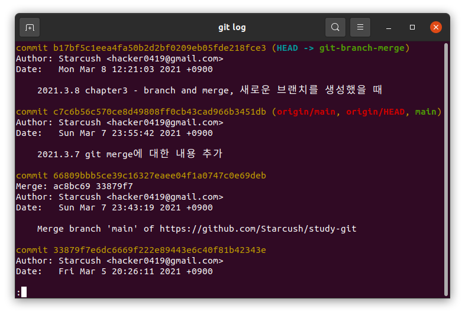
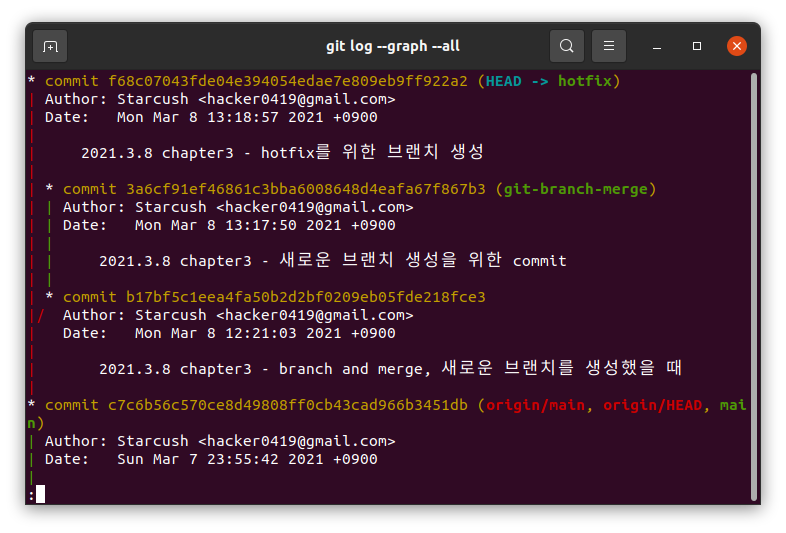

## 브랜치와 Merge이 기초

일반적으로 브랜치로 merge를 활용하는 방법은 다음과 같다.

1. 작업 중인 웹 사이트가 있다.
2. 새롭게 처리할 이슈가 생겨서 새 `branch`를 만든다.
3. 새로 만든 `branch`에서 작업을 한다.

이때 `production` 브랜치에서 급하게 고칠 문제가 생겨서 `hotfix` 브랜치를 만들어야 한다. 그러면 아래와 같이 할 수 있다.

4. `production` 브랜치로 돌아간다.
5. `hotfix` 브랜치를 새로 생성한다.
6. `hotfix`로 새로운 이슈를 해결하고 `production` 브랜치에 `merge`한다.
7. 기존에 작업하던 2번에서 생성한 브랜치로 돌아가 작업을 한다.

### 브랜치의 기초

상황에 맞게 브랜치를 생성하고 이동하는 것을 `progit`에 나와있는 예제가 아닌 현재 프로젝트를 기준으로 생각해보려 한다.
지금까지 `main` 브랜치에 모든 작업을 하고 있었는데 오늘 `branch`의 `merge`에 대해 공부한 내용을 새로운 브랜치를 생성해서 작업하고 싶었고 `git-branch-merge`라는 새로운 브랜치를 만들고 싶다

```
$ git switch -c git-branch-merge
```

- `progit`에는 `git checkout` 명령어를 사용했지만 `git`의 `2.23.0`버전에서 `checkout`의 기능을 `switch`와 `restore`로 분리했기 때문에 브랜치의 생성 및 이동과 관련된 건 `git switch`를 사용하고 있다.
- 관련된 내용
  - [Outsider's Dev Story - 새 버전에 맞게 git checkout 대신 switch/restore 사용하기](https://blog.outsider.ne.kr/1505)
  - [honeymon.io - [Tech] Git 2.23.0 출시: checkout 기능 분리(switch, restore)](http://honeymon.io/tech/2019/08/30/git-2.23-release.html)

`git-branch-merge`라는 브랜치를 만들고 이동했기 때문에 `HEAD`는 `git-branch-merge`를 가리키고 있고


새롭게 추가하고 커밋한다면 `git-branch-merge` 브랜치가 앞서게 된다.


- `HEAD`가 가리키고 있는 `git-branch-merge`가 `main`브랜치보다 1개의 커밋만큼 앞서 있는 것을 볼 수 있다.

그런데 `git-branch-merge`에서 작업하던 도중 `main` 브랜치에서 새롭게 해결해야할 이슈가 발생한다면 어떻게 해야할까?
이때는 그냥 `main`브랜치로 돌아가면 되는데 한 가지 주의해야할 점은 충돌을 방지하기 위해 워킹 디렉토리를 정리하는 것이다.
워킹 디렉토리를 정리하는 방법은 2가지가 있는데

1. 작업하던 내용을 모두 커밋한다.
2. Stash나 커밋 Amend를 사용한다.

그런데 2번은 나중에 다룰 것이기 때문에 이번에는 수정한 내용을 모두 커밋한 후 새로운 브랜치로 이동해보자.
기존에 작업하던 내용을 모두 커밋한 후 `hotfix`라는 브랜치를 생성하고 `checkout`했다.

```
$ git switch -c hotfix
```

그리고 추적하고 있는 파일 하나를 수정한 후 커멋을 하고 `git log` 명령을 사용해서 `hotfix`가 어떻게 갈라져 나왔는지 확인해보자

```
$ git log --graph --all
```



- 내용을 확인해보면 `c7c6b5` 커밋에서 새로운 내용을 추가해서 `b17bf5` 커밋을 만들었고, `b17bf5`에서 `git-branch-merge` 브랜치를 만들어서 `3a6cf9` 커밋을 추가했다.
- 그 후 `main`으로 `checkout`한 후 `hotfix` 브랜치를 생성했고, 새로운 커밋인 `f68c07`을 만들었다.

`hotfix` 브랜치를 만들고 이슈가 해결됐다면 `main` 브랜치에 합쳐야 한다. `git merge` 명령으로 아래와 같이 한다.

```
$ git switch main
$ git merge hotfix
업데이트 중 c7c6b56..f68c070
Fast-forward
 chapter3/test_for_main_branch.md | 2 ++
 1 file changed, 2 insertions(+)
```
