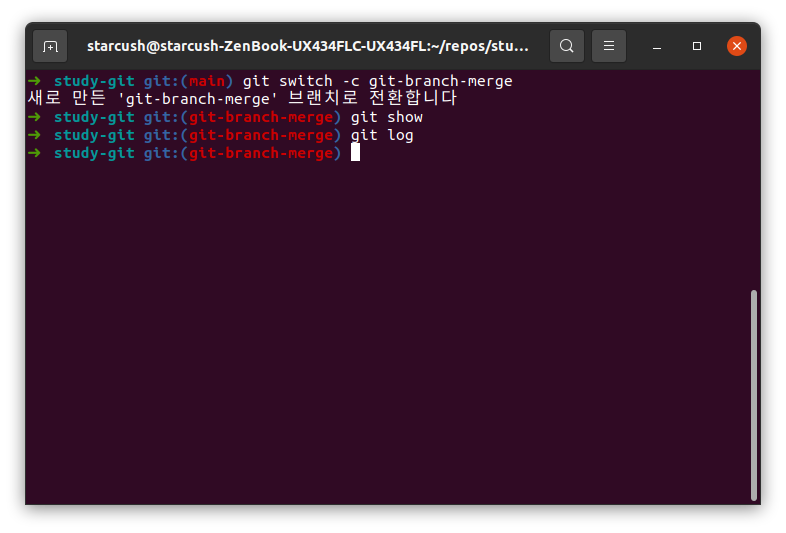
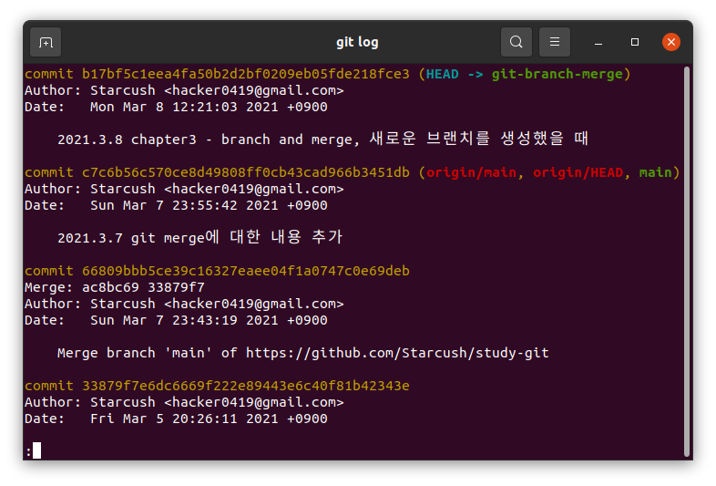
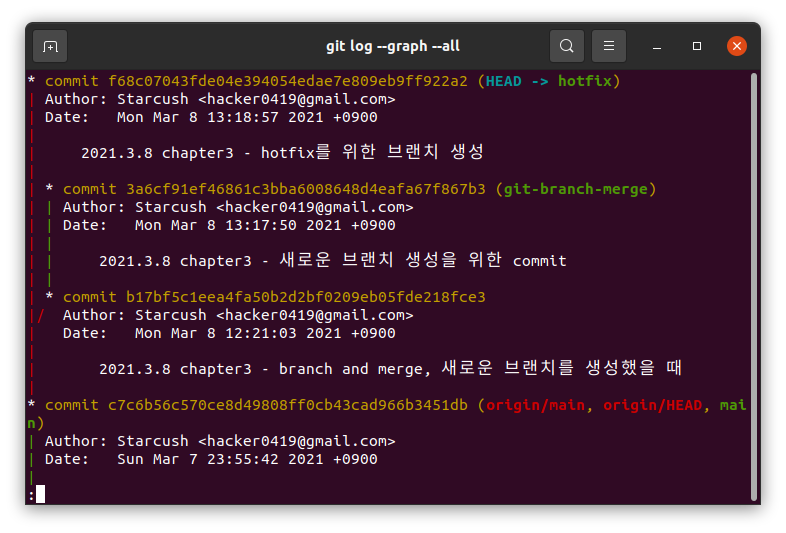
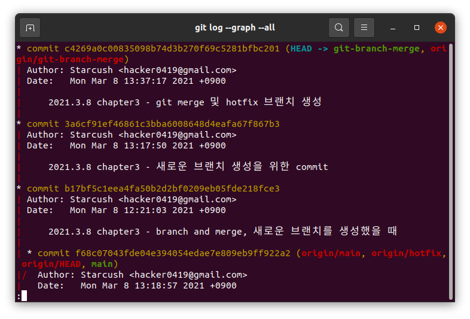
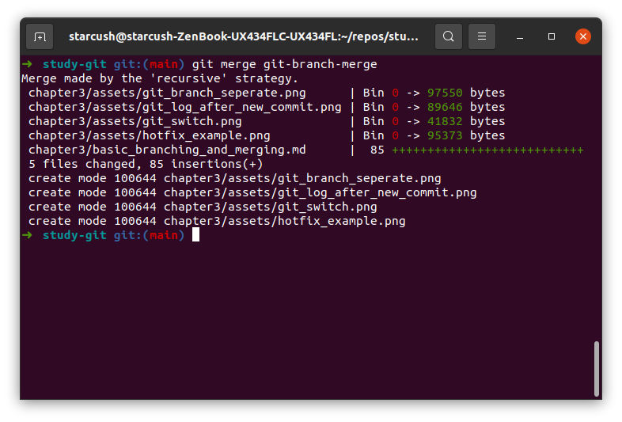
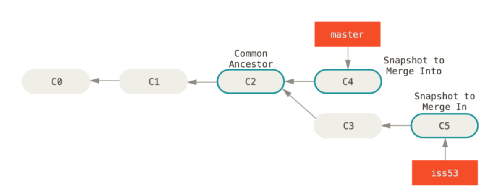
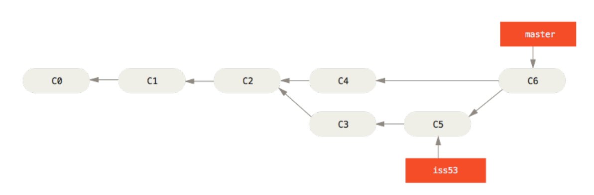
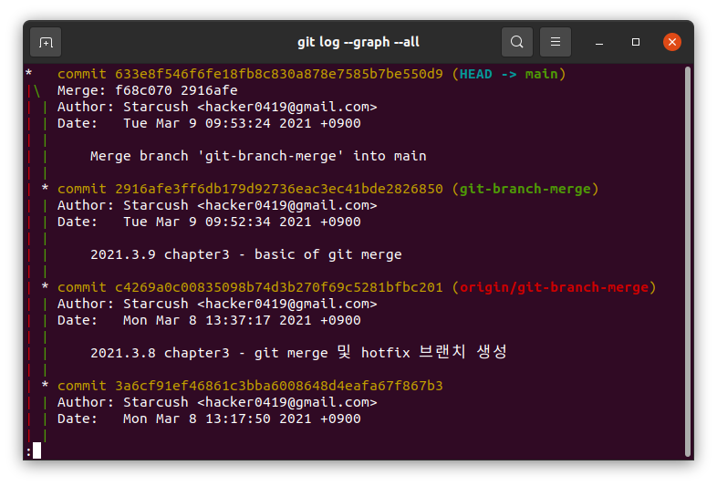

## 브랜치와 Merge이 기초

일반적으로 브랜치로 merge를 활용하는 방법은 다음과 같다.

1. 작업 중인 웹 사이트가 있다.
2. 새롭게 처리할 이슈가 생겨서 새 `branch`를 만든다.
3. 새로 만든 `branch`에서 작업을 한다.

이때 `production` 브랜치에서 급하게 고칠 문제가 생겨서 `hotfix` 브랜치를 만들어야 한다. 그러면 아래와 같이 할 수 있다.

4. `production` 브랜치로 돌아간다.
5. `hotfix` 브랜치를 새로 생성한다.
6. `hotfix`로 새로운 이슈를 해결하고 `production` 브랜치에 `merge`한다.
7. 기존에 작업하던 2번에서 생성한 브랜치로 돌아가 작업을 한다.

### 브랜치의 기초

상황에 맞게 브랜치를 생성하고 이동하는 것을 `progit`에 나와있는 예제가 아닌 현재 프로젝트를 기준으로 생각해보려 한다.
지금까지 `main` 브랜치에 모든 작업을 하고 있었는데 오늘 `branch`의 `merge`에 대해 공부한 내용을 새로운 브랜치를 생성해서 작업하고 싶었고 `git-branch-merge`라는 새로운 브랜치를 만들고 싶다

```
$ git switch -c git-branch-merge
```

- `progit`에는 `git checkout` 명령어를 사용했지만 `git`의 `2.23.0`버전에서 `checkout`의 기능을 `switch`와 `restore`로 분리했기 때문에 브랜치의 생성 및 이동과 관련된 건 `git switch`를 사용하고 있다.
- 관련된 내용
  - [Outsider's Dev Story - 새 버전에 맞게 git checkout 대신 switch/restore 사용하기](https://blog.outsider.ne.kr/1505)
  - [honeymon.io - [Tech] Git 2.23.0 출시: checkout 기능 분리(switch, restore)](http://honeymon.io/tech/2019/08/30/git-2.23-release.html)

`git-branch-merge`라는 브랜치를 만들고 이동했기 때문에 `HEAD`는 `git-branch-merge`를 가리키고 있고


새롭게 추가하고 커밋한다면 `git-branch-merge` 브랜치가 앞서게 된다.


- `HEAD`가 가리키고 있는 `git-branch-merge`가 `main`브랜치보다 1개의 커밋만큼 앞서 있는 것을 볼 수 있다.

그런데 `git-branch-merge`에서 작업하던 도중 `main` 브랜치에서 새롭게 해결해야할 이슈가 발생한다면 어떻게 해야할까?
이때는 그냥 `main`브랜치로 돌아가면 되는데 한 가지 주의해야할 점은 충돌을 방지하기 위해 워킹 디렉토리를 정리하는 것이다.
워킹 디렉토리를 정리하는 방법은 2가지가 있는데

1. 작업하던 내용을 모두 커밋한다.
2. Stash나 커밋 Amend를 사용한다.

그런데 2번은 나중에 다룰 것이기 때문에 이번에는 수정한 내용을 모두 커밋한 후 새로운 브랜치로 이동해보자.
기존에 작업하던 내용을 모두 커밋한 후 `hotfix`라는 브랜치를 생성하고 `checkout`했다.

```
$ git switch -c hotfix
```

그리고 추적하고 있는 파일 하나를 수정한 후 커멋을 하고 `git log` 명령을 사용해서 `hotfix`가 어떻게 갈라져 나왔는지 확인해보자

```
$ git log --graph --all
```



- 내용을 확인해보면 `c7c6b5` 커밋에서 새로운 내용을 추가해서 `b17bf5` 커밋을 만들었고, `b17bf5`에서 `git-branch-merge` 브랜치를 만들어서 `3a6cf9` 커밋을 추가했다.
- 그 후 `main`으로 `checkout`한 후 `hotfix` 브랜치를 생성했고, 새로운 커밋인 `f68c07`을 만들었다.

`hotfix` 브랜치를 만들고 이슈가 해결됐다면 `main` 브랜치에 합쳐야 한다. `git merge` 명령으로 아래와 같이 한다.

```
$ git switch main
$ git merge hotfix
업데이트 중 c7c6b56..f68c070
Fast-forward
 chapter3/test_for_main_branch.md | 2 ++
 1 file changed, 2 insertions(+)
```

`merge` 메세지를 보면 `Fast-forward`라는게 보인다. 이는 `hotfix` 브랜치가 가리키는 `f68c070` 커밋이 `c7c6b56` 커밋에 기반한 브랜치이기 때문에 브랜치 포인터는 `merge` 과정 없이 최신 커밋으로 이동하기만 한다. 이런 `merge` 방식을 `fast forward`라고 부른다.

`hotfix` 브랜치를 통해 급한 이슈를 해결했으니 필요없는 브랜치는 삭제해보자.

```
$ git branch -d hotfix
```

그랬더니 에러 메세지가 뜨면서 삭제가 되지 않는다.

```
error: 'hotfix' 브랜치가 완전히 병합되지 않았습니다.
정말로 삭제하려면 'git branch -D hotfix' 명령을 실행하십시오.
```

- 그래서 `progit`에서 삭제하는대로 했는데 왜 안되는지 찾아봤다
- [stackoverflow](https://stackoverflow.com/questions/7548926/git-error-the-branch-x-is-not-fully-merged)
- [stackoverflow](https://stackoverflow.com/questions/40515232/deleting-merged-branch-gives-error-the-branch-x-is-not-fully-merged/40515435)
- 설명하는 용어들 중 모르는 용어가 많아서 완벽히 이해하지는 못했지만 이해한 범위에서 설명하자면

1. 에러 메세지라기 보다는 경고 메세지이다. 그래서 `git branch -D`를 사용해서 지워도 문제는 안된다.
2. 지우려는 브랜치를 현재의 브랜치에서 확인이 안될 경우(`hotfix` 브랜치는 `main` 브랜치에서 갈라져 나왔고, `main`에 `merge`했기 때문에 `hotfix`에 있던 commit 기록은 `main`에 남아 있다) 경고 메세지를 보여주는 것이다.
3. 그래서 처음에 `hotfix`를 지우려고 할 때 `HEAD`는 `git-branch-merge`에 있었기 때문에 `hotfix`브랜치에서 작업한 커밋 기록을 확인할 수 없었기 때문에 경고 메세지를 남겼다는 것
4. `main` 브랜치로 이동 후 삭제했더니 경고 메세지 없이 삭제가 가능했다.

```
$ git switch main
$ git branch -d hotfix
hotfix 브랜치 삭제 (과거 f68c070).
```

그러면 원래 작업하던 `git-branch-merge` 브랜치로 이동해서 원래 하던 일을 계속해보자.



`git log --graph --all` 명령을 통해 보면 `hotfix` 브랜치가 병합된 `main` 브랜치와는 별개로 `git-branch-merge` 브랜치가 커밋이 쌓이는 것을 확인할 수가 있다. 한마디로 **전에 작업한 `hotfix`가 `git-branch-merge` 브랜치에 영향을 끼치지 않는다는 것**

`git-branch-merge` 브랜치에 `hotfix`가 적용되게 하고 싶다면 `git-branch-merge`에 `main`을 병합하거나 그 반대를 하면 가능하다.

### Merge의 기초

지금까지 작업한 `git-branch-merge` 브랜치를 `main` 브랜치에 병합해보자.

```
$ git switch main
$ git merge git-branch-merge
```



그 결과를 보면 `hotfix`를 병합했을 때 봤던 `fast-forward`가 안 보이는 것을 알 수 있다.
그 이유는 `main` 브랜치는 `hotfix`의 최근에 남겼던 커밋을 가리키고 있고, 이는 처음 `git-branch-merge`가 갈라져 나왔던 `main` 브랜치의 커밋 보다는 앞서가 있기 때문에 `fast-forward` 방식을 적용하지 않는다. 이 경우에는 `Git`은 각 브랜치가 가리키는 커밋 두 개와 공통 조상 하나를 사용하여 `3-way Merge`를 한다.

- 브랜치 이름은 좀 다르지만 `progit`에서 그림으로 알기 쉽게 만들어 놔서 해동 이미지를 가져와 봤다.
  

`3-way Merge`는 `fast forward`처럼 단순히 브랜치 포인터를 최신 커밋으로 옮기는 게 아니라 별도의 커밋을 만들고 나서 해당 브랜치가 그 커밋을 가리키도록 이동시킨다. 그래서 이런 커밋을 `Merge 커밋`이라고 부른다.

- 

- 그럼 실제 내 프로젝트에서 어떻게 `merge 커밋`이 만들어졌는지 확인하자.
  - 
  - `fast forward`의 경우 `main` 브랜치가 `hotfix`의 커밋인 `f68c070`을 가리켰는데 `git-branch-merge`의 최근 커밋인 `2916afe`를 가리키는게 아니라 `633e8f5` 커밋을 새롭게 만들었다.

`git-branch-merge`는 역할을 다 했기 때문에 필요없는 브랜치는 삭제한다.

```
이 부분은 `test-conflict`에서도 수정한 부분
```
