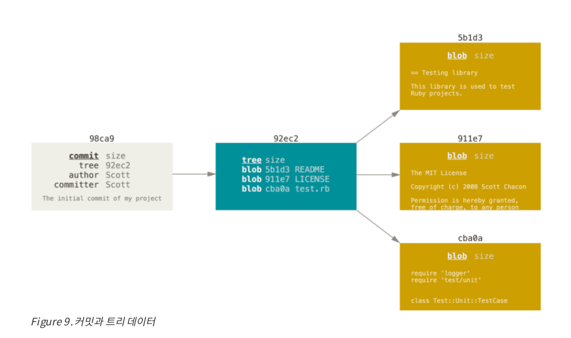
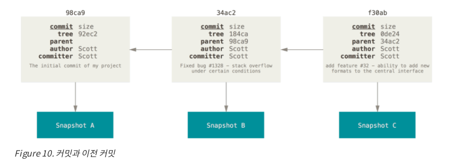
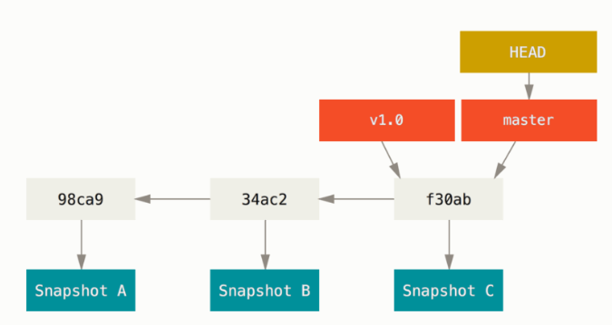
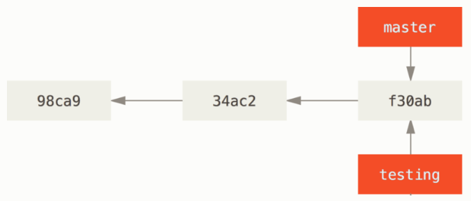
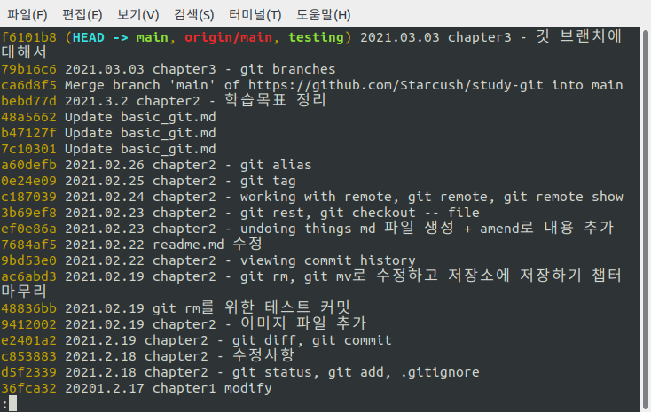
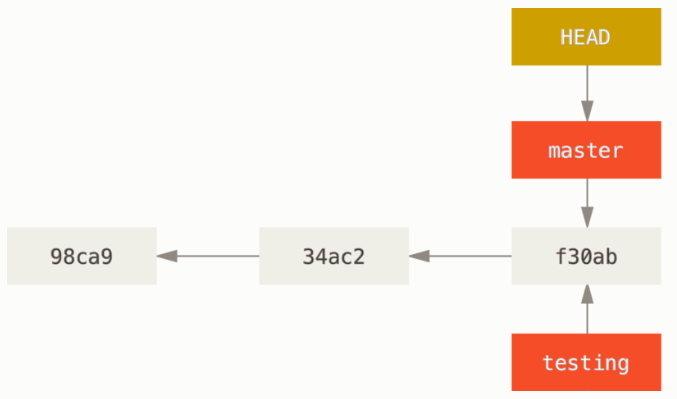
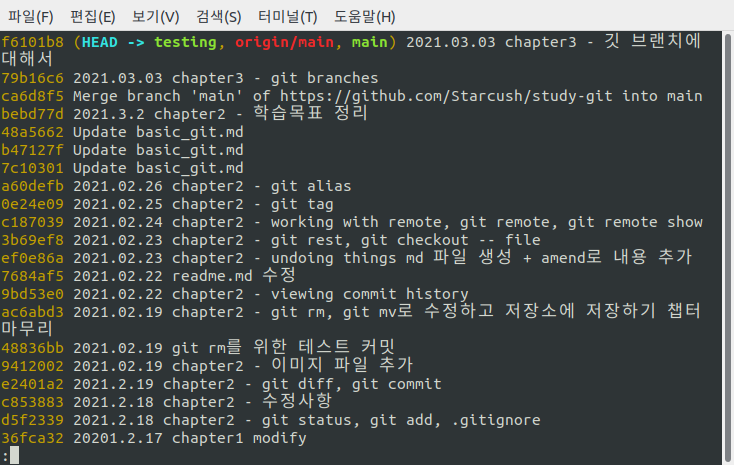
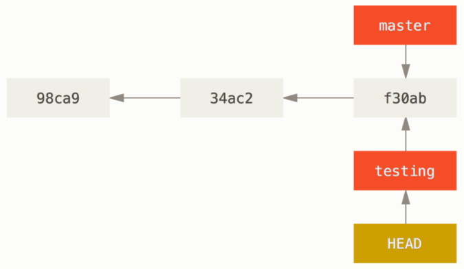

## 브랜치란 무엇인가

이번 쳅터는 어려워서 여러번 읽어봐야할 것 같다.

Git이 브랜치를 다루는 과정을 이해하려면 Git이 데이터를 스냅샷으로 기록한다는 것에 주목해야 한다.

사용자가 변경 내용을 커밋하면 Git은 `**커밋 개체(commit object)**`를 저장하는데 이 객체에는

1. 현 Staging Area에 있는 데이터의 스냅샷에 대한 **포인터**
2. 저자나 커밋 메세지 같은 **메타데이터**
3. **이전 커밋에 대한 포인터**
   등이 포함되 있다.

우리는 커밋 개체의 이전 커밋 포인터가 있기 때문에 **현재 커밋이 무엇을 기준으로 바뀌었는지를 알 수 있다**. 최초 커밋을 제외한 나머지 커밋은 이전 커밋 포인터가 적어도 하나씩은 있고, 여러 브랜치를 합친 Merge 커밋 같은 경우에는 이전 커밋 포인터가 여러개 있다.

새로 생성한 파일도 있지만 3개의 파일을 Staging Area에 저장하고 커밋하는 예제를 살펴보자. 먼저 어떤 파일이 있는지를 이야기해보면 루트 디렉토리에 있던 `README.md`과 이번에 새로 시작한 chapter3와 관련된 파일들이 있다.

```
$ git status
현재 브랜치 main
브랜치가 'origin/main'에 맞게 업데이트된 상태입니다.

커밋하도록 정하지 않은 변경 사항:
  (무엇을 커밋할지 바꾸려면 "git add <파일>..."을 사용하십시오)
  (use "git restore <file>..." to discard changes in working directory)
	수정함:        README.md

추적하지 않는 파일:
  (커밋할 사항에 포함하려면 "git add <파일>..."을 사용하십시오)
	chapter3/

커밋할 변경 사항을 추가하지 않았습니다 ("git add" 및/또는 "git commit -a"를
사용하십시오)
```

파일을 `Stage`하면 Git 저장소에 파일을 저장하고(Git은 이걸 Blob이라고 부른다) `Staging Area`에 해당 파일의 체크섬을 저장한다.

- 여기서 파일을 `Stage`한다는 것은 `git add` 명령을 통해 각각의 체크섬이 생성되고
- `Git Repository`(.git directory)에 해당 버전의 파일을 저장한다는 것(Blob)
- 그리고 `Stating Area`에 체크섬을 저장한다.
- 조금 헷갈리는게 `Git Repository`에 파일을 저장하는 것과 `Staging Area`에 체크섬을 저장하는 것을 왜 구분 할까?
  - 이 문제는 좀 더 공부 한 후 고민해보자

```
git add README.md chapter3/
git commit -m '2021.03.03 chapter3 - git branches'
```

- `git commit` 명령을 통해 커밋을 생성하면, 루트 디렉토리와 하위 디렉토리의 체크섬을 만들고 Git repository에 `tree object`로써 저장된다. 즉 여기서 `Git repository`에 저장된 `tree object`에 들어 있는 건 디렉토리의 `**체크섬**`!

이 작업을 마치고 나면 Git 저장소에는 다섯 개의 데이터 개체가 생긴다.

- 각 파일에 대한 Blob 세 개(Git 저장소에 파일을 저장)
- Blob으로 저장되어 있는 파일과 디렉토리 구조가 들어 있는 트리 개체 하나(파일과 디렉토리 구조를 가진 개체는 별도로 있음)
- 메타데이터(저자나 커밋 메세지)와 루트 트리를 가리키는 포인터가 담긴 커밋 개체 하나(커밋에 대한 정보를 가진 개체 하나)



다시 파일을 수정하고 커밋하면 직전 커밋에 대한 포인터를 함께 저장한다.



- 이미지에 있는 커밋 체크섬을 확인해보면 트리에 대한 체크섬과 parent에 대한 체크섬 정보도 가지고 있다.

Git 에서의 브랜치는 이런 커밋들 사이를 움직일 수 있는 포인트 같은 것이다.



### 새로운 브랜치를 만들어보자

새로운 브랜치를 생성해 보고 브랜치를 어떻게 사용할 수 있는지 알아보자. 먼저 `git branch` 명령을 사용하면 새로운 브랜치를 만들 수 있다.

```
$ git branch testing
```



새롭게 브랜치를 만들었는데 그러면 `Git`은 어떻게 현재 작업 중인 브랜치를 알 수 있을까?
Git은 `**HEAD**`라는 특별한 포인터를 가진다. `**HEAD**`라는 포인터는 현재 위치하고 있는 로컬 브랜치(지금 수정하고 있는)를 가리킨다.
그럼 아까 `git branch`를 통해 새로운 브랜치를 만들었으니 `HEAD`는 `tesing`을 가리키고 있을까?
이는 `git log` 명령을 통해 확인이 가능하다.

```
$ git log --online --decorate
```



- 위의 이미지는 progit에 나온 예제가 아니라 실제 내가 작업하고 있는 git이다 보니 커밋 체크섬이 다르다.

로그를 확인해보면 `HEAD`가 아직 `main` 브랜치를 가리키고 있는 것을 알 수 있다.
이는 `git branch`는 새로운 브랜치를 만들기만 하고 움직이지는 않기 때문이다.



### 브랜치 이동하기

그러면 새로 만든 `testing` 브랜치로 이동해보자. `git checkout` 명령을 사용하면 다른 브랜치로 이동이 가능하다.

```
$ git checkout testing
```



`HEAD`가 `testing`을 가리키고 있는 걸 알 수 있다. 현재의 상태를 커밋 해시는 다르지만 다음과 같은 상황이라고 볼 수 있다.



`testing`으로 옮겨져 있는 상태에서 새롭게 커밋을 해보자.

### 이해가 덜 된 점

- `Staging Area`에 체크섬을 저장한다, 와 Git 저장소에 저장한다는게 어떤게 다를까?
